# RDH-PolyFace — Reversible Data Hiding in Encrypted Polygonal Faces

> **Paper:** Yuan-Yu Tsai, *"Reversible Data Hiding in Encrypted Polygonal Faces Using Vertex Index Similarity"*,
> IEEE Transactions on Multimedia, Vol. 27, pp. 9603–9618, 2025.
> **DOI:** [10.1109/TMM.2025.3613172](https://doi.org/10.1109/TMM.2025.3613172)

---

## ⚠️ Important Scope Note

> This paper operates on **3D mesh polygon indices** — NOT on images.
> - ❌ Hyperspectral images — **not applicable**
> - ❌ 12-bit / HDR images — **not applicable**
> - ✅ Triangular/polygonal 3D model face index values (OBJ / PLY format)
>
> "Intensity shifting" in this context refers to **index value shifting** of vertex indices
> within each polygonal face — analogous to histogram shifting in image RDH but operating
> on the discrete vertex-index space of a 3D mesh.

---

## Pipeline Diagram (with Equations)

```mermaid
flowchart TD
    A["🔷 INPUT\n3D Mesh: Vertices V, Faces F\nKeys: KE (encrypt), KD (message)\nThreshold T, k = ⌈log₂n⌉"]

    A --> B["STEP A — Right Circular Shifting\ncircshift(F_i) so min(F_i) → position 1\nPreserves polygon normal vector\n📐 No equation — cyclic permutation"]

    B --> C{"STEP B — Classify Each Face\nDᵢ = max(F'ᵢ) − min(F'ᵢ)"}

    C -->|"Dᵢ ≤ T AND\nsame binary region"| HoP["HoP Face\n(Homogeneous Polygon)\nIndices are close together"]
    C -->|"else"| HeP["HeP Face\n(Heterogeneous Polygon)\nIndices are spread out"]

    HoP --> L1H["STEP C — LZC Labels (HoP)\n📌 Eq.1: L¹ᵢ = LZC(v'¹ᵢ − v'¹ᵢ₋₁)\n📌 Eq.2: L²ᵢ = LZC(v'²ᵢ − v'¹ᵢ)\n📌 Eq.2: L³ᵢ = LZC(v'³ᵢ − v'¹ᵢ)\nLabel = number of leading zeros in difference"]

    HeP --> L1E["STEP C — LZC + mMSB Labels (HeP)\n📌 Eq.1: L¹ᵢ = LZC(v'¹ᵢ − v'¹ᵢ₋₁)\n4 reference neighbours for L², L³\nIf v_proc ≥ v_ref → LZC\nIf v_proc < v_ref  → mMSB\nLabel = max over 4 neighbours"]

    L1H --> EC["📌 Embedding Capacity Formula\nECᵗᵢ = min(k, Lᵗᵢ + 1)\n(L+1)-th bit is always '1'\n→ first L bits are freely modifiable"]
    L1E --> EC

    EC --> HHE["STEP D — Hybrid Huffman Encoding\nTree₁  → encodes L¹ labels (1st index)\nTree₂₃ → encodes L², L³ labels (2nd+3rd)\nOutputs: compressed aux_bits stream"]

    HHE --> ENC["STEP E — Face Encryption\n📌 Eq.3 (Range-Preserving XOR)\ne' = XOR(e, KE_stream)\nIf e' out of range → modular wrap:\n  e' = 2ᵏ + (e'−2ᵏ) mod (n−2ᵏ)  if e≥n\n  e' = 2ᵏ + (e'+2ᵏ) mod (n−2ᵏ)  if e<2ᵏ\nKeeps encrypted index in same region"]

    ENC --> AUX["STEP F — Auxiliary Info Embedding\nEmbed into 1st-index bits (vertical order)\nContent: [Tree₁ | Tree₂₃ | labels | pos p | rec_info]\nEC¹ᵢ bits used per face\n📌 1st index always has highest EC → guaranteed space"]

    AUX --> MSG["STEP G — Message Hiding\nXOR msg with KD stream → msg_enc\nEmbed msg_enc into 2nd + 3rd index bits\nEC²ᵢ + EC³ᵢ bits per face\nTotal capacity ≈ 32.63 bpp"]

    MSG --> OUT["🔶 OUTPUT\nF_marked: Encrypted + Embedded 3D Model\nVertex positions UNCHANGED\nOnly polygon index values modified"]

    OUT --> REC["── RECEIVER ──\nSTEP H — Extraction + Decryption\n1. Read aux bits from 1st-index positions\n2. Decode Huffman → recover EC values\n3. Decrypt message: XOR with KD stream\n4. Restore indices:\n   LZC path:  set bits 1..EC-1=0, ECth=1, +ref\n   mMSB path: copy bits 1..EC-1 from ref, flip ECth\n→ Original F' perfectly restored ✓"]
```



---

## Bit-Level Embedding Diagram

This shows **which bits are used at each step** for a single triangular face with k=4 (n≤16 vertices):

```
Face F'ᵢ = (v'¹, v'², v'³)  after RCS, before encryption
           [Index 1]  [Index 2]  [Index 3]

           b₄b₃b₂b₁  b₄b₃b₂b₁  b₄b₃b₂b₁   ← binary bits (LSB = b₁)
           ─────────────────────────────────
           If L¹=2, EC¹=3:
           [?][?][?][1]  ← bits b₁,b₂,b₃ = MODIFIABLE (green ✓)
                          bit  b₄         = FIXED (orange ✗)

           If L²=1, EC²=2:
                     [?][?][1][·]  ← bits b₁,b₂ = MODIFIABLE
                                     bits b₃,b₄  = FIXED

           If L³=0, EC³=1:
                               [?][1][·][·]  ← bit b₁ = MODIFIABLE
                                               bits b₂,b₃,b₄ = FIXED

Step F (Aux Info): fills modifiable bits of Index 1 first (vertical across all faces)
Step G (Message):  fills remaining modifiable bits of Index 2 and Index 3

Embedding order within each index:  b₁ → b₂ → b₃ → ... → b_{EC}
The (EC+1)-th bit is always '1' — this is the structural anchor for recovery.
```

---

## How "Index Shifting" Works (Analogy to Image RDH)

In image-domain RDH, pixel *intensity values* are shifted to create space for embedding.
In this paper, **vertex index values** play the same role:

| Image RDH | This Paper (3D Mesh) |
|-----------|----------------------|
| Pixel intensity histogram | Vertex index value distribution |
| Histogram bin shift | LZC / mMSB label (measures index difference) |
| Peak bin P | First-index reference v'¹ᵢ₋₁ |
| Zero bin Z | Bin where difference = 0 (L = k) |
| Shift pixels above P up by 1 | Encrypted index adjusted by Eq.3 |
| Embed 0/1 at peak pixels | Embed bits in first L modifiable positions |
| Eq.1 in image papers | **Eq.1 here**: L¹ᵢ = LZC(v'¹ᵢ − v'¹ᵢ₋₁) |

The key insight: instead of shifting a 2D histogram of pixel intensities, this method
shifts the **leading-zero structure** of the binary difference between consecutive face indices.

---

## Key Equations Reference

| Eq. | Formula | Used In |
|-----|---------|---------|
| **Eq. 1** | `L¹ᵢ = LZC(v'¹ᵢ − v'¹ᵢ₋₁)` | 1st index label for all faces |
| **Eq. 2** | `Lᵗᵢ = LZC(v'ᵗᵢ − v'¹ᵢ), t=2,3` | 2nd/3rd index labels for HoP faces |
| **Eq. 3** | Range-preserving XOR (see diagram above) | Face encryption |
| **EC formula** | `ECᵗᵢ = min(k, Lᵗᵢ + 1)` | Bits embeddable per index |
| **Di** | `max(F'ᵢ) − min(F'ᵢ) ≤ T` | HoP/HeP classification condition |

---

## Results Summary

| Metric | Value |
|--------|-------|
| Avg embedding capacity (T=10) | **32.63 bpp** |
| Avg embedding capacity (T=1000) | **33.71 bpp** |
| Best prior method (Sui [17]) | 28.00 bpv |
| 1st index contribution | 16.21 bpp (constant, independent of T) |
| Vertex coordinates modified | **None** |
| Reversibility | **Perfect** (lossless recovery) |

---

## Usage

```matlab
cd 'c:\iiitvd\New Paper 19.05.2026\RDH_PolyFace_Matlab'
RDH_PolyFace
```

Expected output:
```
=== RDH in Encrypted Polygonal Faces (Tsai, IEEE TMM 2025) ===
Model:    Bunny (synthetic)
Vertices: 1000  |  Faces: 2000  |  n=1000  k=10  T=10
Message: 500 bits
--- EMBEDDING ---
Auxiliary info: XXX bits
Total embedding capacity: XXXX bits (XX.XX bpp)
Message embedded: 500 bits
--- EXTRACTION & DECRYPTION ---
Message recovery:  PASS
Face restoration:  PASS
```

## Files

| File | Description |
|------|-------------|
| `RDH_PolyFace.m` | Complete MATLAB R2025b implementation (single file) |
| `RDH_PolyFace_Demo_Report.md` | Full demo report (CE-MRIMR template format) |
| `README.md` | This file — pipeline diagram + equations |

## Requirements

- MATLAB R2025b
- Statistics and Machine Learning Toolbox (for `huffmandict`; fallback included)
- No Image Processing Toolbox needed
- No GPU required
