# RDH-PolyFace — Reversible Data Hiding in Encrypted Polygonal Faces

> **Paper:** Yuan-Yu Tsai, IEEE Transactions on Multimedia, Vol.27, pp.9603–9618, 2025.
> **DOI:** [10.1109/TMM.2025.3613172](https://doi.org/10.1109/TMM.2025.3613172)

---

## ⚠️ Scope

Operates on **3D mesh polygon indices** (OBJ/PLY) — NOT images.
*"Index shifting"* ≡ histogram shifting but on vertex-index space.

---

## Pipeline (graph TD — with equations)

```mermaid
graph TD

    %% ── INPUT ──────────────────────────────────────────────
    subgraph ING["INPUT"]
        A["📐 3D Mesh\nFaces F  (n×3 integers, 0-based)\nKeys: KE · KD   Threshold: T\nk = ⌊log₂ n⌋\nRE1=[0, 2ᵏ−1]   RE2=[2ᵏ, n−1]"]
    end

    %% ── STEP A ─────────────────────────────────────────────
    subgraph STA["Step A — Right Circular Shift  (Sec.III-B)"]
        B["🔄 RCS Reorder\nShift each face so min index is first\nF'[i] = circshift(F[i], −argmin+1)\nPreserves face normal direction"]
    end

    %% ── STEP B/C ───────────────────────────────────────────
    subgraph SBC["Step B/C — Similarity Labels  (Sec.III-C/D)"]
        C{"🔀 Classify Face\nDᵢ = max(F'ᵢ) − min(F'ᵢ)\nHoP if Dᵢ ≤ T AND same region\nHeP otherwise"}

        D["✅ HoP\nEq.1: L¹ = LZC(v₁ − ref)\nEq.2: L² = LZC(v₂ − v₁)\n       L³ = LZC(v₃ − v₁)\nref = 0 / 2ᵏ / v₁ᵢ₋₁"]

        E["⚡ HeP\nEq.1: L¹ same as HoP\nL², L³ via 4-neighbour:\n  vₜ ≥ ref → LZC(vₜ − ref)\n  vₜ < ref → mMSB(vₜ, ref)\nBest label wins"]

        F["📌 Embedding Capacity\nEC = min(k, L + 1)\nPositions 1…L  → FREE bits\nPosition  L+1  → structural '1'\nMATLAB bit = k − paper_pos + 1"]
    end

    %% ── STEP D ─────────────────────────────────────────────
    subgraph STD["Step D — Huffman Encoding  (Sec.III-E)"]
        G["🗜 HHE  (Hybrid Huffman Encoding)\nTree₁  → L¹ labels\nTree₂₃ → L², L³ labels\naux_bits = trees + encoded labels\nReceiver needs aux_bits to decode"]
    end

    %% ── STEP E/F/G ─────────────────────────────────────────
    subgraph EFG["Step E+F+G — Pre-transform → Embed → Encrypt  (Sec.III-F/G/H)"]
        H["🔑 KD Stream  (before KE!)\nrng(KD) → kd_stream\nmsg_enc = msg XOR kd_stream\npayload = [aux_bits | rec_info | msg_enc]"]

        I["🔀 Pre-transform\nLZC & L>0 → e_val = v − ref  (diff d)\nLZC & L=0 → e_val = v  (no transform)\nmMSB      → e_val = v  (no transform)\nd ∈ RE1 always when LZC+L>0"]

        J["✍ Embed Payload\nfor b = 1…L:\n  set_bit(e_val, b, payload[ptr++])\nif L>0: set_bit(e_val, L+1, 1)  ← anchor"]

        K["📌 Eq.3 — Range-Preserving XOR\nrng(KE)  →  rnd_val\ne_enc = e_val XOR rnd_val\nif RE1 & e_enc ≥ 2ᵏ → mod 2ᵏ\nif RE2 & out-of-range → wrap to [2ᵏ,n−1]\nEncrypted index stays in same region ✓"]

        L["🔶 F_marked\nEncrypted + embedded mesh\nVertex XYZ unchanged"]
    end

    %% ── STEP H ─────────────────────────────────────────────
    subgraph STH["Step H — Extract + Decrypt  (Sec.III-I)"]
        M["🔓 XOR Decrypt\nrng(KE) — same seed, same order\ne_dec = e_enc XOR rnd_val  (cancels ✓)\nnbits: k if LZC+L>0 or ref<2ᵏ\n       k+1 if mMSB+ref≥2ᵏ"]

        N["📤 Extract Payload\nRead bits 1…L from e_dec\nSplit: aux → Huffman decode → L values\n       rec_info → pred types\n       msg_enc → KD decrypt → msg"]

        O["🔁 Restore Index\nClear bits 1…L → set bit L+1=1\nLZC & L>0: v = e_dec + ref\nLZC & L=0 / mMSB: v = e_dec\nClamp to [0, n−1]"]
    end

    %% ── OUTPUT ─────────────────────────────────────────────
    subgraph OUT["OUTPUT"]
        P["✅ Results\nF_dec == F_rcs  → Face PASS ✓\nmsg_dec == msg  → Msg  PASS ✓\nCapacity: 32.63 bpp  (T=10)\nVertex positions: UNCHANGED"]
    end

    %% ── CONNECTIONS ────────────────────────────────────────
    A --> B
    B --> C
    C -->|"Dᵢ ≤ T & same region"| D
    C -->|"else"| E
    D --> F
    E --> F
    F --> G
    G --> H
    H --> I
    I --> J
    J --> K
    K --> L
    L --> M
    M --> N
    N --> O
    O --> P

    ING --> STA
    STA --> SBC
    SBC --> STD
    STD --> EFG
    EFG --> STH
    STH --> OUT

    %% ── STYLES ─────────────────────────────────────────────
    style A  fill:#1e1e2e,stroke:#74c7ec,stroke-width:2px,color:#cdd6f4
    style B  fill:#1e1e2e,stroke:#fab387,stroke-width:2px,color:#cdd6f4
    style C  fill:#313244,stroke:#f9e2af,stroke-width:2px,color:#f9e2af
    style D  fill:#1e1e2e,stroke:#a6e3a1,stroke-width:2px,color:#cdd6f4
    style E  fill:#1e1e2e,stroke:#cba6f7,stroke-width:2px,color:#cdd6f4
    style F  fill:#181825,stroke:#89dceb,stroke-width:3px,color:#cdd6f4
    style G  fill:#1e1e2e,stroke:#fab387,stroke-width:2px,color:#cdd6f4
    style H  fill:#1e1e2e,stroke:#f38ba8,stroke-width:2px,color:#cdd6f4
    style I  fill:#1e1e2e,stroke:#89b4fa,stroke-width:2px,color:#cdd6f4
    style J  fill:#1e1e2e,stroke:#89b4fa,stroke-width:2px,color:#cdd6f4
    style K  fill:#181825,stroke:#f38ba8,stroke-width:3px,color:#cdd6f4
    style L  fill:#002200,stroke:#a6e3a1,stroke-width:3px,color:#a6e3a1
    style M  fill:#181825,stroke:#f38ba8,stroke-width:3px,color:#cdd6f4
    style N  fill:#1e1e2e,stroke:#89dceb,stroke-width:2px,color:#cdd6f4
    style O  fill:#1e1e2e,stroke:#89dceb,stroke-width:2px,color:#cdd6f4
    style P  fill:#002200,stroke:#a6e3a1,stroke-width:3px,color:#a6e3a1
```



---

## Paper Flow — Plain English

| # | Step | What it does | Why |
|---|------|-------------|-----|
| **A** | **RCS** | Rotate each face so smallest index is first | Makes 1st-index differences predictable |
| **B** | **Classify** | HoP if all 3 indices are close together in same region | HoP gets simpler Eq.2 labels |
| **C** | **Labels** | Count leading zeros (LZC) in binary diff between indices | More zeros = more free bits to embed |
| **D** | **Huffman** | Compress labels into `aux_bits` stream | Receiver needs labels to know EC per index |
| **E** | **Pre-transform** | Replace `v` with `d = v − ref` (when L>0) | Exposes leading zeros for embedding |
| **F** | **Embed** | Write payload bits into leading-zero positions | Uses free bits without changing structure |
| **G** | **XOR Encrypt** | XOR each modified index with KE stream (Eq.3) | Hides embedded bits from eavesdropper |
| **H** | **Decrypt+Extract** | Reverse: XOR → read bits → restore d → recover v | Perfect reversibility guaranteed |

> **Key insight:** The **leading zeros** in the binary representation of the difference `d = v − ref` are "empty space" that can safely carry message bits. The structural `1` bit at position `L+1` acts as a delimiter — it tells the receiver exactly where to stop and where to restore the original value.

---

## Key Equations

| Eq. | Formula | Step |
|-----|---------|------|
| **k** | `k = ⌊log₂ n⌋` | Global — defines bit-width |
| **Eq. 1** | `L¹ = LZC(v₁ − ref)`, ref ∈ {0, 2ᵏ, v₁ᵢ₋₁} | Step C — all faces |
| **Eq. 2** | `L² = LZC(v₂ − v₁)`, `L³ = LZC(v₃ − v₁)` | Step C — HoP only |
| **EC** | `EC = min(k, L + 1)` | Step C — bits per index |
| **Eq. 3** | `e' = v XOR rnd`, range-preserving mod wrap | Step G — encryption |
| **Di** | `max(F') − min(F') ≤ T` AND same region → HoP | Step B |

---

## Results (Table VIII, T=10, 20 models)

| Model | Faces | BPP |
|-------|-------|-----|
| Bunny | 69,451 | 32.63 |
| Dragon | 202,520 | 31.44 |
| Teeth | 10,010 | 33.91 |
| **Avg (20 models)** | — | **32.63** |
| Best prior (Sui [17]) | — | 28.00 |

---

## Usage

```matlab
cd 'c:\iiitvd\New Paper 19.05.2026\RDH_PolyFace_Matlab'
RDH_PolyFace
```

Expected:
```
Message recovery:  PASS ✓
Face restoration:  PASS ✓
```

## Files

| File | Description |
|------|-------------|
| `RDH_PolyFace.m` | MATLAB implementation v4 (no extra toolbox needed) |
| `RDH_PolyFace_Demo_Report.md` | Demo report (CE-MRIMR template) |
| `README.md` | This file |

## Requirements
- MATLAB R2025b+  ·  No Image/GPU toolbox needed
