# RDH-PolyFace — Reversible Data Hiding in Encrypted Polygonal Faces

> **Paper:** Yuan-Yu Tsai, *"Reversible Data Hiding in Encrypted Polygonal Faces Using Vertex Index Similarity"*,
> IEEE Transactions on Multimedia, Vol. 27, pp. 9603–9618, 2025.
> **DOI:** [10.1109/TMM.2025.3613172](https://doi.org/10.1109/TMM.2025.3613172)

---

## ⚠️ Scope

> This paper operates on **3D mesh polygon indices** — NOT on images.
> - ❌ Hyperspectral / 12-bit images — **not applicable**
> - ✅ Triangular/polygonal 3D model face index values (OBJ / PLY format)
>
> *"Intensity shifting"* here means **vertex-index value shifting** — analogous to histogram shifting in image RDH but on the discrete vertex-index space of a 3D mesh.

---

## Full Pipeline Diagram (with Equations at Every Step)

```mermaid
graph TD

    %% ─────────────────────────────────────────────────────────
    subgraph ING["1.  INPUT  —  3D Mesh + Keys"]
        MESH["📐 3D Mesh  (OBJ / PLY format)\n\nVertices V  (unchanged throughout)\nFaces    F  (n×3 integer matrix)\nVertex count = n  →  indices 0 … n−1\n\nKeys:  KE (face encryption seed)\n       KD (message encryption seed)\nThreshold T  (HoP/HeP boundary)"]
        PARAMS["📊 Key Parameter\n\nk = ⌊log₂ n⌋          ← FLOOR (not ceil)\n\nRE1 = [ 0 ,  2ᵏ−1 ]   low  region\nRE2 = [ 2ᵏ,  n−1  ]   high region\n\nExample: n=200 → k=7\n  RE1 = [0, 127]   RE2 = [128, 199]"]
    end

    %% ─────────────────────────────────────────────────────────
    subgraph RCS["2.  Step A  —  Right Circular Shifting  (Sec.III-B)"]
        RCSA["🔄 RCS Reorder\n\nFor each face i:\n  pos = argmin( F[i,:] )\n  F'[i,:] = circshift( F[i,:], −(pos−1) )\n\nResult: F'[i,1] = min index of face i\n        (smallest index always first)\n\n⚠ Normal vector direction preserved\n  by cyclic shift (not full sort)"]
    end

    %% ─────────────────────────────────────────────────────────
    subgraph SIM["3.  Step B/C  —  Similarity Calculation  (Sec.III-C/D)"]
        CLASS{"🔀 HoP / HeP Classification\n\nDᵢ = max(F'ᵢ) − min(F'ᵢ)\nsame_region = ALL in RE1 OR ALL in RE2\n\nHoP  if  Dᵢ ≤ T  AND  same_region\nHeP  otherwise"}

        HOP["✅ HoP  (Homogeneous Polygon)\n\n📌 Eq. 1  (1st index, all faces):\n  L¹ᵢ = LZC( v'¹ᵢ − ref¹ᵢ )\n\n  where ref¹ᵢ =\n    0        if i = 1\n    2ᵏ       if i = p  (first RE2 face)\n    v'¹ᵢ₋₁  otherwise\n\n📌 Eq. 2  (2nd and 3rd index, HoP only):\n  L²ᵢ = LZC( v'²ᵢ − v'¹ᵢ )\n  L³ᵢ = LZC( v'³ᵢ − v'¹ᵢ )\n\n  LZC = leading-zero count in k-bit MSB-first\n  representation of the non-negative difference"]

        HEP["⚡ HeP  (Heterogeneous Polygon)\n\n📌 Eq. 1  (1st index) — same as HoP\n\n4-Neighbour Prediction  (Fig.3):\n  Candidates for v'²ᵢ: [pv1, pv2, pv3, v'¹ᵢ]\n  Candidates for v'³ᵢ: [v'¹ᵢ, v'²ᵢ, pv1, pv2]\n\n  For each candidate ref_r (same region only):\n    if v'ᵗᵢ ≥ ref_r → LZC( v'ᵗᵢ − ref_r )\n    if v'ᵗᵢ <  ref_r → mMSB( v'ᵗᵢ, ref_r )\n\n  mMSB = count of matching MSBs between v and ref\n  Best label (max) wins → pred_type + win_ref stored"]

        EC["📌 Embedding Capacity\n\n  ECᵗᵢ = min( k,  Lᵗᵢ + 1 )\n\n  Positions 1…Lᵗᵢ  (paper MSB-first)  = FREE\n  Position   Lᵗᵢ+1                    = structural '1'\n\n  MATLAB bit mapping:\n  Paper pos p  ↔  MATLAB bit  k−p+1\n  (position 1 = MSB = MATLAB bit k)\n\n  L=0 case: EC=1, zero free bits → index not transformed"]
    end

    %% ─────────────────────────────────────────────────────────
    subgraph HHE["4.  Step D  —  Hybrid Huffman Encoding  (Sec.III-E)"]
        HUFF["🗜 Huffman Compression of Labels\n\n  Tree₁  → encodes {L¹ᵢ}  (1st-index labels)\n  Tree₂₃ → encodes {L²ᵢ, L³ᵢ}  (2nd+3rd)\n\n  aux_bits = [ serialize(Tree₁)\n             | huffmanenco(L¹)\n             | serialize(Tree₂₃)\n             | huffmanenco(L², L³) ]\n\n  Receiver uses aux_bits to reconstruct\n  all L values and hence all EC values\n  before any decryption is attempted"]
    end

    %% ─────────────────────────────────────────────────────────
    subgraph EMBD["5.  Step E+F+G  —  Pre-transform → Embed → Encrypt  (Sec.III-F/G/H)"]
        KD_STEP["🔑 KD Pre-encryption  (BEFORE KE seed set)\n\n  rng(KD)\n  kd_stream = rand_bits(|msg|)\n  msg_enc   = msg XOR kd_stream\n\n  ⚠ Critical order: KD stream must be generated\n  BEFORE rng(KE) is called, otherwise the KE\n  face-encryption stream would be contaminated"]

        PAYLOAD["📦 Payload Assembly\n\n  payload = [ aux_bits | rec_flat | msg_enc ]\n\n  rec_flat = flatten( rec_info[:,1:3] )\n           = 3 bits × Nf  (is_hop, pred_L2, pred_L3)\n\n  Total payload embedded into face index bits"]

        PRETRANS["🔀 Pre-encrypt Transform  (per face, per index t)\n\n  if pred = LZC  AND  Lᵗᵢ > 0:\n    e_val = v'ᵗᵢ − refᵗᵢ   ← difference d  (≥ 0)\n    d is always in RE1  [0, 2ᵏ−1]\n\n  if pred = LZC  AND  Lᵗᵢ = 0  (no leading zeros):\n    e_val = v'ᵗᵢ             ← no transform\n\n  if pred = mMSB:\n    e_val = v'ᵗᵢ             ← no transform"]

        EMBED["✍ Embed Payload into Leading-Zero Positions\n\n  for b_paper = 1 … Lᵗᵢ:\n    MATLAB bit = k − b_paper + 1\n    e_val ← set_bit( e_val, b_paper, payload[ptr++] )\n\n  Structural bit  (only if Lᵗᵢ > 0):\n    set_bit( e_val, Lᵗᵢ+1, 1 )   ← anchor '1'"]

        XOR_ENC["📌 Eq. 3  —  Range-Preserving XOR Encryption\n\n  nbits = k   if e_val < 2ᵏ  (RE1)\n  nbits = k+1 if e_val ≥ 2ᵏ  (RE2)\n\n  rnd_val = randi([0, 2ⁿᵇⁱᵗˢ − 1])  ← KE stream\n  e_enc   = e_val XOR rnd_val\n\n  Range-preserving adjustment:\n  if RE1 and e_enc ≥ 2ᵏ:\n    e_enc = e_enc mod 2ᵏ\n  if RE2 and e_enc ≥ n:\n    e_enc = 2ᵏ + (e_enc−2ᵏ) mod (n−2ᵏ)\n  if RE2 and e_enc < 2ᵏ:\n    e_enc = 2ᵏ + (e_enc+2ᵏ) mod (n−2ᵏ)\n\n  ✅ Encrypted index stays in same region as original"]

        FOUT["🔶 OUTPUT: F_marked\n\nEncrypted + payload-embedded face matrix\nVertex positions UNCHANGED\nPolygon index values modified"]
    end

    %% ─────────────────────────────────────────────────────────
    subgraph DEC["6.  Step H  —  Extraction + Decryption  (Sec.III-I)"]
        XOR_DEC["🔓 XOR Decrypt  (same KE seed, same order)\n\n  rng(KE)   ← reset to same state as encryption\n\n  For each face i, index t  (same loop order):\n    nbits = k   if pred=LZC and L>0   (d in RE1)\n    nbits = k   if ref < 2ᵏ           (RE1 case)\n    nbits = k+1 if ref ≥ 2ᵏ           (RE2 case)\n\n    rnd_val = randi([0, 2ⁿᵇⁱᵗˢ − 1])  ← same value!\n    e_dec   = e_enc XOR rnd_val        ← XOR cancels ✓"]

        EXTRACT["📤 Extract Payload Bits  (Step 2)\n\n  for b_paper = 1 … Lᵗᵢ:\n    payload_bit = get_bit( e_dec, b_paper )\n    all_payload.append( payload_bit )\n\n  After all faces: split all_payload into\n    aux_bits   → decode Huffman → recover L values\n    rec_flat   → recover pred types and refs\n    msg_enc    → KD-decrypt to recover message"]

        RESTORE["🔁 Index Restoration  (Step 3+4)\n\n  Clear bits 1…L:   set_bit(e_dec, b, 0)  for b=1..L\n  Restore structural: set_bit(e_dec, L+1, 1)  if L>0\n\n  → e_dec is now the original pre-embedded value\n\n  if pred=LZC and L>0:\n    v_rec = e_dec + ref       ← d + ref = v  ✓\n\n  if pred=LZC and L=0  OR  pred=mMSB:\n    v_rec = e_dec             ← identity (no transform)\n\n  Clamp: v_rec = max(0, min(n−1, v_rec))"]

        KD_DEC["🔑 KD Message Decryption\n\n  rng(KD)   ← called AFTER all XOR decrypt loops\n  kd_stream = rand_bits(|msg_enc|)\n  msg       = msg_enc XOR kd_stream  ← recovers original\n\n  ✅ Perfect reversibility:\n    F_dec == F_rcs  (original polygon indices)\n    msg_dec == msg  (original secret message)"]
    end

    %% ─────────────────────────────────────────────────────────
    subgraph OUT["7.  OUTPUT / RESULTS"]
        RES["✅ Verification\n\nMessage recovery:   PASS ✓\nFace restoration:   PASS ✓\nVertex positions:   UNCHANGED\n\nAvg capacity (T=10, 20 models): 32.63 bpp\nBest prior method (Sui [17]):   28.00 bpv\nImprovement:                    +16%"]
    end

    %% ─────────────────────────────────────────────────────────
    %% Flow connections
    MESH    --> PARAMS
    PARAMS  --> RCSA

    RCSA    --> CLASS
    CLASS   -->|"Dᵢ ≤ T AND same region"| HOP
    CLASS   -->|"else"| HEP
    HOP     --> EC
    HEP     --> EC
    EC      --> HUFF

    HUFF    --> KD_STEP
    KD_STEP --> PAYLOAD
    PAYLOAD --> PRETRANS
    PRETRANS--> EMBED
    EMBED   --> XOR_ENC
    XOR_ENC --> FOUT

    FOUT    --> XOR_DEC
    XOR_DEC --> EXTRACT
    EXTRACT --> RESTORE
    RESTORE --> KD_DEC
    KD_DEC  --> RES

    ING --> RCS
    RCS --> SIM
    SIM --> HHE
    HHE --> EMBD
    EMBD --> DEC
    DEC --> OUT

    %% ─────────────────────────────────────────────────────────
    %% Styles
    style MESH      fill:#1e1e2e,stroke:#74c7ec,stroke-width:2px,color:#cdd6f4
    style PARAMS    fill:#1e1e2e,stroke:#89b4fa,stroke-width:2px,color:#cdd6f4
    style RCSA      fill:#1e1e2e,stroke:#fab387,stroke-width:2px,color:#cdd6f4
    style CLASS     fill:#313244,stroke:#f9e2af,stroke-width:2px,color:#f9e2af
    style HOP       fill:#1e1e2e,stroke:#a6e3a1,stroke-width:2px,color:#cdd6f4
    style HEP       fill:#1e1e2e,stroke:#cba6f7,stroke-width:2px,color:#cdd6f4
    style EC        fill:#1e1e2e,stroke:#89dceb,stroke-width:3px,color:#cdd6f4
    style HUFF      fill:#1e1e2e,stroke:#fab387,stroke-width:2px,color:#cdd6f4
    style KD_STEP   fill:#1e1e2e,stroke:#f38ba8,stroke-width:2px,color:#cdd6f4
    style PAYLOAD   fill:#1e1e2e,stroke:#f9e2af,stroke-width:1px,color:#cdd6f4
    style PRETRANS  fill:#1e1e2e,stroke:#89b4fa,stroke-width:2px,color:#cdd6f4
    style EMBED     fill:#1e1e2e,stroke:#89b4fa,stroke-width:2px,color:#cdd6f4
    style XOR_ENC   fill:#181825,stroke:#f38ba8,stroke-width:3px,color:#cdd6f4
    style FOUT      fill:#002200,stroke:#a6e3a1,stroke-width:3px,color:#a6e3a1
    style XOR_DEC   fill:#181825,stroke:#f38ba8,stroke-width:3px,color:#cdd6f4
    style EXTRACT   fill:#1e1e2e,stroke:#89dceb,stroke-width:2px,color:#cdd6f4
    style RESTORE   fill:#1e1e2e,stroke:#89dceb,stroke-width:2px,color:#cdd6f4
    style KD_DEC    fill:#1e1e2e,stroke:#f38ba8,stroke-width:2px,color:#cdd6f4
    style RES       fill:#002200,stroke:#a6e3a1,stroke-width:3px,color:#a6e3a1
```



---

## Key Equations Reference

| Eq. | Formula | Step |
|-----|---------|------|
| **Eq. 1** | `L¹ᵢ = LZC(v'¹ᵢ − ref¹ᵢ)` where ref=0 (i=1), 2ᵏ (i=p), v'¹ᵢ₋₁ (else) | Step C — 1st index label |
| **Eq. 2** | `Lᵗᵢ = LZC(v'ᵗᵢ − v'¹ᵢ)`, t=2,3 | Step C — HoP 2nd/3rd labels |
| **Eq. 3** | Range-preserving XOR: `e' = v XOR rnd`, then modular wrap if out of region | Step E — Encryption |
| **EC**    | `ECᵗᵢ = min(k, Lᵗᵢ + 1)` — L free bits + 1 structural bit | Step C |
| **k**     | `k = ⌊log₂ n⌋` — **floor** not ceil | Global |
| **Di**    | `Dᵢ = max(F'ᵢ) − min(F'ᵢ) ≤ T  AND  same region → HoP` | Step B |
| **d**     | `d = v − ref ≥ 0` when LZC, L>0; `e_val=v` when L=0 or mMSB | Step E — pre-transform |

---

## How "Index Shifting" Relates to Image RDH

| Image RDH | This Paper (3D Mesh) |
|-----------|----------------------|
| Pixel intensity histogram | Vertex index value distribution |
| Histogram bin shift | LZC / mMSB label (difference leading zeros) |
| Peak bin P | First-index reference `v'¹ᵢ₋₁` |
| Shift pixels above P by 1 | Encrypted index adjusted by Eq. 3 |
| Embed 0/1 at peak pixels | Embed bits in MSB positions 1…L |

---

## Results (Paper Table VIII, T=10)

| Model | Faces | HoP% | BPP |
|-------|-------|------|-----|
| Bunny | 69,451 | 41.82% | 32.63 |
| Dragon | 202,520 | 5.21% | 31.44 |
| HappyBuddha | 543,652 | 7.31% | 31.72 |
| Teeth | 10,010 | 30.11% | 33.91 |
| **Average (20 models)** | — | — | **32.63** |

Best prior method (Sui [17]): **28.00 bpv** — this paper improves by **+16%**

---

## Usage

```matlab
cd 'c:\iiitvd\New Paper 19.05.2026\RDH_PolyFace_Matlab'
RDH_PolyFace
```

Expected:
```
=== RDH in Encrypted Polygonal Faces (Tsai, IEEE TMM 2025) ===
Vertices: 200 | Faces: 400 | n=200 | k=7 | 2^k=128 | T=10
RE1=[0,127]  RE2=[128,199]
Message: 200 bits
--- EMBEDDING ---
--- EXTRACTION & DECRYPTION ---
Message recovery:  PASS ✓
Face restoration:  PASS ✓
```

## Files

| File | Description |
|------|-------------|
| `RDH_PolyFace.m` | Complete MATLAB implementation v4 (single file, no extra toolbox needed) |
| `RDH_PolyFace_Demo_Report.md` | Full demo report (CE-MRIMR template) |
| `README.md` | This file — pipeline diagram + equations |

## Requirements

- MATLAB R2025b+
- Statistics Toolbox optional (Huffman; fallback with `dec2bin` included)
- No Image Processing Toolbox needed
- No GPU required
